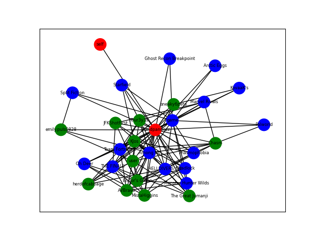

Vapor
-------

Doing stuff with Steam. Don't know what yet.

## Getting Started
Currently, the application is not published anywhere and must be built from source, thus you must first clone the repository to the system you'd like to run `vapor` on.

### Setup Environment
A few environment variables need to be acquired and set for your personal use:

#### Steam
Acquire a Steam Web API Key [here](https://steamcommunity.com/dev) (use `localhost` for the domain name) and set the following environment variable:
```shell
export STEAM_API_KEY="<your api key>"
```
Also, get your Steam ID (the actual ID number, not your username) and set this:
```shell
export STEAM_ID="<your steam id>"
```
TODO: Windows/Mac

#### Data Storage
Determine a good place to store and persist your `vapor` data, and then set the path to this variable:
```shell
export VAPOR_DATA_PATH="<path/to/your/data/folder>"
```

### Docker Installation
This application requires Docker to run, whether you are a user or developing the codebase. Install Docker depending on your OS:

#### Windows/Mac
Install [Docker Desktop]()

#### Linux
Install [Docker via CLI]()

#### Build
Build the application containers with:
```shell
docker compose build
```

## Usage
Currently, this program simply queries the Steam Web API to find games that you and your friends (and your friends' friends, and...) are playing and creates the resulting graph.

TODO: Transition to docker commands.

### Graph Population
To create your `SteamUserGraph` and store it, run:
```bash
python vapor/populate.py
```
Example output (shortened):
```text
### Adding games... ###
Graph population complete, saved to ./data/steamgraph.gml.gz
Stats:
game 1242
self 1
user 11
```

### Graph Display
To display your "subgraph", which is only your friends and the games you have in common:
```bash
python vapor/draw.py
```


### Game Info
To retrieve a game description along with information about who in your `SteamUserGraph` plays the game:
```bash
python vapor/info.py -a <app_id>
# Example - Stardew Valley:
python vapor/info.py -a 413150
```
Example output (shortened):
```text
<<< Game info for app_id=413150 >>>

========== Stardew Valley ==========

Stardew Valley is an open-ended country-life RPG!
### More info...###

========== Graph Info ==========

You do not play this game.
7 user(s) related to you play this game:
["Endor's Game", 'Chasm', 'JFKShotFirst', 'MistaHiggins', 'KJos', 'emily.puls0828', 'The Great Jumanji']
```

## Development
Refer to this section only if you are developing the codebase. 

### Requirements
- Python
- Pip

### Installation
Install the editable `dev` package, preferably within a virtual environment, with:
```shell
pip install -e .[dev]
```

### Development Checklist
- [] Ensure [environment](#installation) is setup and activated
- [] Make code changes with proper [formatting](#code-formatting)
- [] Locally, ensure passing [unit tests](#unit-tests)
- [] Additionally run necessary [integration tests](#integration-tests)
- [] TODO: CI/CD with Actions

#### Code Formatting
This codebase is formatted using `black`. Prior to pushing any changes/commits, format them with:
```shell
black vapor
```

#### Unit Tests
TODO - `pytest`

#### Integration Tests
TODO - Locally run with Docker 
